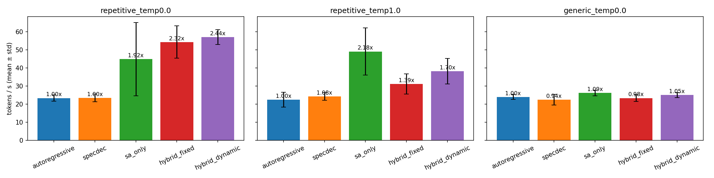
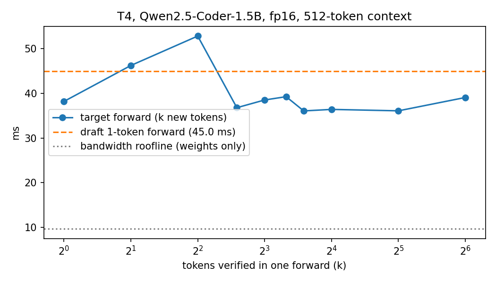

# Suffix Automaton + Dynamic-Length Speculative Decoding

[](https://colab.research.google.com/github/Matthew-Matta/hybrid-suffix-speculative-decoding/blob/main/notebooks/demo.ipynb)

**2.44x throughput vs autoregressive** on repetitive code generation (57.1 ± 4.1 vs 23.4 ± 1.7 TPS, greedy, T4 GPU, 5 repeats) using zero-cost suffix automaton drafts routed by a cost-aware controller. On generic prompts the gain is small (1.05–1.09x), and a 0.5B draft model gives **no** speedup on this hardware despite 88% acceptance — see [v2 results](#results--v2-t4-gpu-colab-free-tier).

Implements **dynamic-length speculation**, future work named in Baseten's [SA MTP blog post (Jan 27, 2026)](https://www.baseten.co/blog/boosting-mtp-acceptance-rates-in-baseten-speculation-engine/#suffix-automaton-decoding) — on top of a full reimplementation of the dual-SA speculative decoding architecture from `sa_spec`, extended with per-source draft routing (SA vs draft model vs AR fallback).

---

## v2 changes (Sept 2026)

v2 fixes correctness and efficiency issues found while reviewing v1. The [v2 results](#results--v2-t4-gpu-colab-free-tier) below were re-measured with the fixed code; the v1 tables are kept for comparison.

| Issue in v1 | Fix in v2 |
|---|---|
| Sampled mode was **not exact**: after rejecting an SA draft `x`, the correction token was drawn from the full target distribution `p` (so `x` could be re-drawn, biasing output toward drafted tokens). Draft-model rejections used `p·(1−q(x))` instead of `max(0, p − q)`. | Residual is now `normalize(max(0, p − q))`: for SA drafts that is `p` with `x` zeroed; the draft model keeps its full `q` vector. Verified statistically in `tests/test_rejection_sampling.py`. |
| **Two target forwards per step**: verify pass, then a separate forward just for the bonus token. | The bonus/correction token becomes `pending` and is fed at the front of the *next* verify batch (`[pending] + drafts`). Every step is exactly one target forward. |
| Controller never shortened SA drafts (`max(...)` instead of `min(...)`). | Fixed. |
| Draft model re-ran on committed tokens every step, even SA steps. | Lazy sync: draft KV catches up only when the controller routes to the draft model. |
| Draft-vs-AR routing used `rate × k > 1` with an assumed cost. | Picks k maximising `E[tokens/step] / (1 + k·c)` with `c` = measured draft/target time ratio; routes to AR when no k beats 1. |
| AR steps counted as "accepted" drafts, inflating acceptance. | Acceptance is over speculative proposals only; new `tokens_per_target_forward` metric. |
| Single runs, no variance; no correctness test. | Repeats with mean ± std; greedy output checked token-for-token against AR (`tests/test_equivalence.py`). |

Run tests: `python -m pytest -q tests` (CPU, tiny random models, ~1 min).

---

## What this implements

### 1. Pure-Python Suffix Automaton (`src/suffix_automaton.py`)

O(n) construction via Blumer's algorithm — same algorithm as Baseten's C++/CUDA `sa_spec` repo, reimplemented in Python for portability. Supports:

- Online `extend_one(token)` — O(1) amortized per token
- `query(context, max_draft_len, temperature)` — walks automaton from current context suffix, returns draft candidates + match length; temperature-aware draft selection (greedy uses `last_tok`, sampled uses frequency-weighted selection — picks the most common continuation seen during construction)
- `DualSuffixAutomaton` — static automaton from prompt + dynamic automaton extended token-by-token during generation (mirrors the dual-SA architecture in `sa_spec`)

### 2. Hybrid Speculative Decoding (`src/speculative_decode.py`)

Five modes in a single `HybridSpecDecoder.generate()` call:

| Mode | Draft source | Draft length |
|------|-------------|--------------|
| `autoregressive` | None | 1 |
| `specdec` | Draft model | Fixed |
| `sa_only` | Suffix automaton | Fixed |
| `hybrid_fixed` | SA → draft model fallback | Fixed |
| `hybrid_dynamic` | SA → draft model fallback | **Adaptive** |

Exact speculative sampling (Leviathan et al. 2023; Chen et al. 2023): accept with `min(1, p/q)`, otherwise sample from `normalize(max(0, p − q))`. For SA drafts `q` is one-hot, so acceptance is `p(x)` and the residual is `p` with `x` removed.

KV cache maintained across all decoding steps — each forward pass processes only the new draft tokens, not the full growing sequence.

### 3. Dynamic Length Controller (DLC) — novel contribution

This implementation extends the idea beyond draft **length** to draft **source routing**:
- Separate rolling-window acceptance rate trackers for SA and draft-model sources
- SA draft length adjusts up/down based on 80%/40% acceptance thresholds, clamped to [2, 10]
- **Cost-aware source routing**: draft-model length k maximises `E[tokens/step] / (1 + k·c)`, where `c` is the measured draft/target forward-time ratio; if no k beats 1, the step falls back to autoregressive
- Explores the draft model until it has a few observations, then re-probes periodically so a stale estimate can recover

---

## Results — v2 (T4 GPU, Colab free tier)

Qwen2.5-Coder-1.5B-Instruct target, Qwen2.5-Coder-0.5B-Instruct draft, fp16, batch 1. 5 repeats per config, mean ± std. Produced by [`notebooks/v2_results.ipynb`](notebooks/v2_results.ipynb); raw data in [`results/v2_results.json`](results/v2_results.json).



### Repetitive code prompt, greedy (300 tokens)

| Mode | TPS | Speedup | Tokens / target forward | Acceptance (SA / draft) |
|---|---|---|---|---|
| autoregressive | 23.4 ± 1.7 | 1.00x | 1.00 | – |
| specdec | 23.5 ± 2.1 | 1.00x | 4.48 | – / 87.9% |
| sa_only | 44.9 ± 20.2 | 1.92x | 3.12 | 39.5% / – |
| hybrid_fixed | 54.3 ± 8.9 | 2.32x | 5.17 | 46.3% / 90.0% |
| **hybrid_dynamic** | **57.1 ± 4.1** | **2.44x** | 2.61 | 65.0% / 76.7% |

### Repetitive code prompt, sampled (temperature 1.0, 300 tokens)

| Mode | TPS | Speedup | Tokens / target forward | Acceptance (SA / draft) |
|---|---|---|---|---|
| autoregressive | 22.5 ± 4.1 | 1.00x | 1.00 | – |
| specdec | 24.3 ± 2.1 | 1.08x | 4.26 | – / 82.1% |
| **sa_only** | **49.1 ± 13.0** | **2.18x** | 1.97 | 36.4% / – |
| hybrid_fixed | 31.2 ± 5.6 | 1.39x | 3.94 | 39.6% / 58.6% |
| hybrid_dynamic | 38.2 ± 7.1 | 1.70x | 1.79 | 50.8% / 61.6% |

### 10 generic code prompts, greedy (128 tokens)

| Mode | TPS | Speedup | Tokens / target forward |
|---|---|---|---|
| autoregressive | 24.0 ± 1.4 | 1.00x | 1.00 |
| specdec | 22.5 ± 3.0 | 0.94x | 4.05 |
| sa_only | 26.2 ± 1.5 | 1.09x | 1.09 |
| hybrid_fixed | 23.4 ± 1.9 | 0.97x | 3.82 |
| hybrid_dynamic | 25.1 ± 1.4 | 1.05x | 1.23 |

### Why the draft model doesn't help here: the regime is overhead-bound



| | Target (1.5B) | Draft (0.5B) |
|---|---|---|
| Layers | 28 | 24 |
| 1-token forward, 512-token context | 38.2 ms | 45.0 ms |
| Bandwidth roofline (weights / 320 GB/s) | 9.7 ms | – |

* A target forward takes ~4x its bandwidth roofline, and verifying up to 64 tokens costs about the same as one: per-step cost is dominated by kernel-launch / Python overhead, which scales with **layer count**, not parameters.
* The draft has 0.32x the parameters but 0.86x the layers, and its forward is actually *slower* than the target's (c = 1.18).
* With c ≥ 1 a draft model can never win at any acceptance rate: even at 100% acceptance, k drafts yield (k+1) tokens for (1 + k·c) ≥ (k+1) target-forward-equivalents. That is exactly what specdec shows: 4.48 tokens per target forward, 1.00x speedup.
* The cost-aware controller in `hybrid_dynamic` learns this and falls back to SA/AR; its remaining draft probes are why it trails `sa_only` in the sampled run.

**Measurement caveat.** Greedy repeats do identical work (same tokens, same forward counts), yet `sa_only` wall time ranged from 3.7 s to 9.5 s across repeats. That is Colab T4 timing noise, not the algorithm (an SA query costs ~0.01 ms). *Tokens per target forward* is deterministic under greedy decoding and is the more reliable comparison.

## Results — v1 (T4 GPU, Colab free tier)

> ⚠️ v1 numbers. The temperature=1.0 rows used the biased v1 sampler; greedy rows are valid but predate the one-forward-per-step fix.

*All numbers from a single end-to-end notebook run. Re-run the Colab to reproduce — numbers vary slightly between runs.*

### SA showcase — repetitive code prompt (temperature=1.0)

The showcase prompt provides two fully-implemented Calculator methods and asks the model to complete four more in the same style. At temperature=1.0 the model stochastically revisits patterns like `(self, x: float, y: float) -> float:` and `return x`. The substrings the SA was built from.

| Mode | TPS | SA acceptance | Avg draft len | vs AR |
|------|-----|---------------|---------------|-------|
| `autoregressive` | 22.8 | — | 1.00 | 1.00x |
| `sa_only` | **49.2** | **38.7%** | **6.28** | **2.16x** |
| `hybrid_dynamic` | 16.7 | 23.9% | 4.39 | 0.73x |

**sa_only at 2.16x** is the headline: suffix-link fallback produces ~6 draft tokens per SA firing (up from ~1.3 before the fix), and every accepted token is pure profit since SA proposals are dict lookups — zero forward passes.

`hybrid_dynamic` was slower in v1 because its controller never shortened drafts and routed to the draft model with an assumed cost; see v2 for the measured cost model.

### Greedy SA showcase — SA's best case (temperature=0)

At temperature=0, SA's `last_tok` prediction is deterministic: it records what the target model chose last time it saw this context. On repeated patterns, this matches the target's argmax perfectly.

| Mode | TPS | Acceptance | Avg draft len | SA acceptance | vs AR |
|------|-----|------------|---------------|---------------|-------|
| `autoregressive` | 23.0 | 100.0% | 1.00 | — | 1.00x |
| `specdec` | 12.1 | 55.9% | 3.94 | — | 0.53x |
| `sa_only` | **46.6** | 44.1% | **5.85** | **39.5%** | **2.03x** |
| `hybrid_dynamic` | **31.1** | 43.7% | 5.89 | 39.5% | **1.35x** |

### Mini-benchmark — 10 generic code prompts (temperature=0)

On diverse, non-repetitive prompts (glaiveai/code_edits_sample), SA fires less often. This is the baseline — SA helps on repetitive patterns, breaks even elsewhere.

| Mode | TPS | Acceptance | SA acc | Draft acc | Avg draft len |
|------|-----|------------|--------|-----------|---------------|
| `autoregressive` | 22.7 | 100.0% | — | — | 1.00 |
| `specdec` | 7.7 | 27.2% | — | 27.2% | 3.91 |
| `sa_only` | 22.7 | 60.4% | 8.8% | — | 1.64 |
| `hybrid_fixed` | 8.5 | 25.8% | 9.5% | 29.6% | 4.34 |
| `hybrid_dynamic` | 12.0 | 53.7% | 8.6% | 24.7% | 1.96 |

SA breaks even on generic prompts (no downside — zero-cost proposals).

v1 attributed the draft model's slowdown to the 3x parameter ratio. The v2 measurements show the real cause: at batch 1 on a T4 the draft's forward pass is *slower* than the target's, because cost tracks layer count rather than parameters (see [v2](#why-the-draft-model-doesnt-help-here-the-regime-is-overhead-bound)).

---

## Architecture

```
Prompt tokens
     │
     ▼
┌──────────────────────────────┐
│      DualSuffixAutomaton     │
│  prompt_sa (static)          │  ◄── built once from prompt
│  live_sa   (dynamic)         │  ◄── extended per accepted token
└──────────┬───────────────────┘
           │ query(context, draft_len, temperature) → (draft_tokens, match_len)
           ▼
┌──────────────────────────────┐
│    DynamicLengthController   │
│  SA window:    [...]         │  ◄── per-source rolling acceptance
│  draft window: [...]         │
└──────────┬───────────────────┘
           │ draft length + source    
           ▼
┌─────────────────────────────────────────┐
│           HybridSpecDecoder             │
│                                         │   ┌──────────────────┐
│  if SA match ≥ threshold:               │   │  Draft Model     │
│      use SA drafts (p_draft = 1)        │◄──│  Qwen2.5-0.5B   │
│  else:                                  │   └──────────────────┘
│      draft model or AR (cost model)     │
│                                         │   ┌──────────────────┐
│  single target forward pass (KV cached) │──►│  Target Model    │
│  exact rejection sampling               │   │  Qwen2.5-1.5B   │
│  update live SA + DLC                   │   └──────────────────┘
└─────────────────────────────────────────┘
```

---

## Quickstart

[](https://colab.research.google.com/github/Matthew-Matta/hybrid-suffix-speculative-decoding/blob/main/notebooks/demo.ipynb)

Single click — runs on a free T4 GPU. No local setup required.

---

## Connection to Baseten's work

| Baseten's `sa_spec` | This repo |
|---------------------|-----------|
| C++/CUDA SA construction, O(n) Blumer | `SuffixAutomaton` — pure Python, same algorithm |
| Dual automaton (prompt-static + generation-dynamic) | `DualSuffixAutomaton` |
| SA threshold parameter (default 4 in sa_spec) | `sa_threshold` (configurable, default 2) |
| Draft model fallback when SA match insufficient | `HybridSpecDecoder` hybrid modes |
| TPS / TTFT / E2E latency / acceptance rate metrics | `GenerationMetrics`, `MetricsTracker` |
| **"dynamically adjust speculation length"** — named future work, [Jan 27 post](https://www.baseten.co/blog/boosting-mtp-acceptance-rates-in-baseten-speculation-engine/#suffix-automaton-decoding) | `DynamicLengthController` — **implemented here** |

---

## Repo structure

```
src/
  suffix_automaton.py   # O(n) Blumer SA, DualSuffixAutomaton
  speculative_decode.py # HybridSpecDecoder, DynamicLengthController
  benchmark.py          # 5-method benchmark harness with CLI
  utils.py              # MetricsTracker, GenerationMetrics, plots
tests/
  test_rejection_sampling.py  # output distribution == p (statistical), controller routing
  test_equivalence.py         # greedy output == autoregressive, token for token, all modes
  test_suffix_automaton.py    # SA construction and queries
notebooks/
  demo.ipynb            # Colab-ready walkthrough (10 sections, v1)
  v2_results.ipynb      # Cost model + repeated benchmarks behind the v2 results
results/
  v2_results.json       # Raw v2 metrics (T4)
  figures/              # v2_tps.png, verify_cost_vs_k.png
```

---

## Models

| Role | Model | VRAM (FP16) |
|------|-------|------------|
| Target | `Qwen/Qwen2.5-Coder-1.5B-Instruct` | ~4 GB |
| Draft | `Qwen/Qwen2.5-Coder-0.5B-Instruct` | ~2 GB |

Same model family as Baseten's published benchmarks. Both fit on a free T4 (16 GB).
